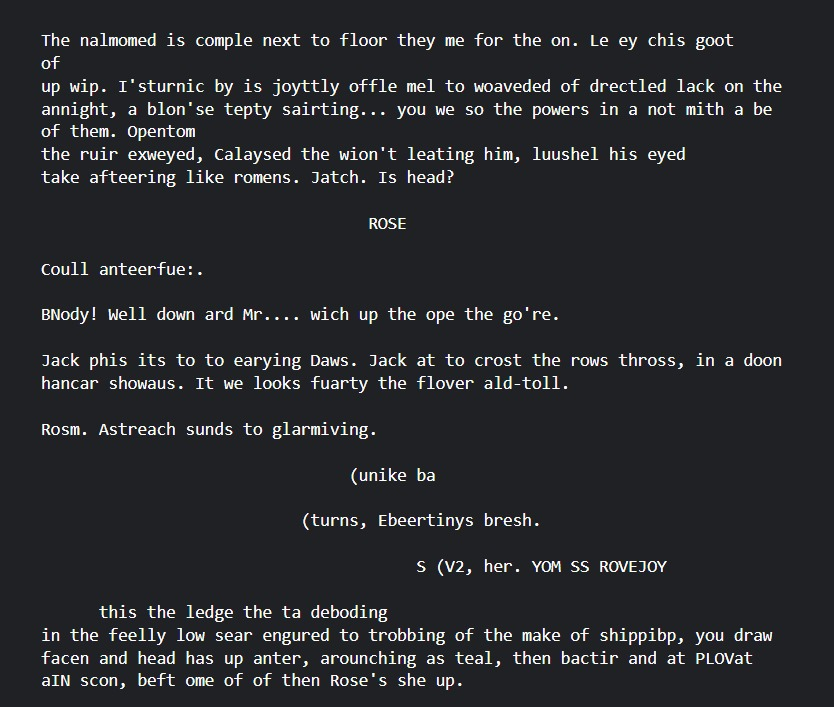

## Transformer Decoder

I trained this transformer decoder model on the Titanic Screenplay dataset with the following hyperparameters: 
`BLOCK_SIZE = 128\n
BATCH_SIZE = 64\n
n_embd = 64\n
dropout = 0.2`

The result of this training is below:

Learned this from Karpathy Sensei and implemented it. Huge Thanks to Sensei!!!
